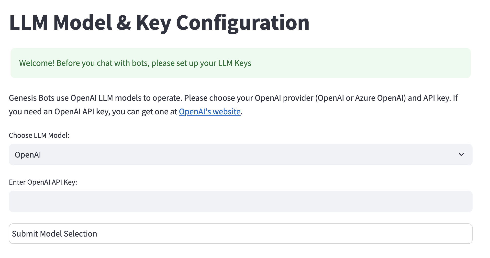

# Genesis Bots - Overview

This repository contains the public open source code for the `genesis-bots` system by Genesis Computing.
For more information, visit https://docs.genesiscomputing.com/docs/.

The rest of this guide assume you are familiar with the basic concepts of GenBots and wish to see the Genesis system in action by setting up and testing the system yourself.

## System components

### Genesis Server
At its core, the Genesis system requires a running server. The server is responsible for:
- Managing the lifeycle, state and health of the GenBots.
- Servicing calls from multiple client applications to interact with the bots, manage configuration and setup integration with external systems (e.g. database connections).
- Continously monitoring your data sources for keeping its internal data model and semantic layers up to date
- Driving independent tasks performed by genbots.

### Genesis UI (Streamlit)
This repo contains a Streamlit UI aplicaiton which can be used to manage the configuraiton of the system as well as chat directly with the GenBots configured on the system.

### GenesisAPI
Users can leverage the Genesis system to build custom agentic AI Data workflows. Genesis offers a Python API which wraps REST endpoints exposed by the server. The API allows users to interact with GenBots, create new GenBots, use custom client-side tools, push/pull content, etc.

The repository includes several sripts that demonstrates the power of the API.

## Installation

You have several options:

**Setup A - Developer mode**: Clone the repo and run the Genesis server and other applicaitons directly from the source code.

**Setup B - Package mode**: `pip`-install the latest genesis package from Pyhon Package Index and interact with the system through the Streamlit App, Slack or Teams. You will only need to clone this repostory if you want to run the example GenesisAPI scripts against that server, or to peek into the srouce code.

**Setup C - Snowflake Native App**: Run the Genesis system as a Snowflake Native app on your own Snowflake account. The Genesis server, along with the Streamlit App will also be runing natively and securely inside your own Snowflake account. . You will only need to clone this repostory if you want to run the example GenesisAPI scripts against that server, or to peek into the srouce code.

### Prerequisites

If you intend to run the server or any of the GensisAPI exanples yourself, then you would need Python 3.10 and up installed.
To verify the python version that is installed on your system, you can run the following command in your terminal or command prompt:

```sh
python3 --version
```

### Setup A - Developer mode
1. Clone the repo into a working directory
   ```sh
   git clone https://github.com/genesis-bots/genesis-bots.git
   cd gensis-bots
   ```
2. Setup and activate your virtualenv

   On Linux and MacOS:
   ```sh
   python -m venv venv-gbots && source venv-gbots/bin/activate
   ```
   On Windows:
   ```sh
   python -m venv venv-gbots && venv-gbots\Scripts\activate
   ```

3. Install required packages
   ```sh
   pip install -r requirements.txt
   ```

Next steps:
1. Run the server locally (see below).
2. (Optional) run the GenesisAPI example scripts (see below).

### Setup B - Package mode

1. Setup and activate your virtualenv

   On Linux and MacOS:
   ```sh
   python -m venv venv-gbots && source venv-gbots/bin/activate
   ```
   On Windows:
   ```sh
   python -m venv venv-gbots && venv-gbots\Scripts\activate
   ```

2. Install the genesis-bots package
   ```sh
   pip install genesis-bots
   ```
Next steps:
1. Run the server locally (see below).
2. (Optional) run the GenesisAPI example scripts (see below).
   
### Setup C - Snowflake Native App
In this setup we assume you already have the Genesis System running as a native Snowflake application (see [documentation](https://docs.genesiscomputing.com/docs/home) and that you want to run the GenesisAPI example scripts, connecting them to the same server.

1. follow the same steps as in  **Setup A** to setup a working repository and environment locally.
2. 

Next steps;
1. run the GenesisAPI example scripts (see below).


### Prepare your environment
Note: This step is required for all setups where you intend to run the server and/or the GenesisAPI examples yourself.

1. **Create a working directory**

  We will be creating a working direcotry called `genesis-bots` (feel free to use any othert name)
   ```sh
   mkdir genesis-bots
   cd genesis-bots
   ```
1. **Create a python virtualenv**
   ```sh
   python3 -m venv venv-gbots
   ```
   Activate the virtual environment by running the following command:

   On Mac/Linux:

   ```sh
   source venv-gbots/bin/activate
   ```

   On Windows:

   ```sh
   venv-gbots\Scripts\activate
   ```
### Setup A - Developer mode

1. Clone the repo
   ```sh
   git clone 
   ```

- `pip` (Python package manager)

- `genesis-bots` package (see below)

### Installing the `genesis-bots` package

Before running the scripts, it's recommended to create a virtual environment to manage dependencies. Follow these steps:

1. **Create a Virtual Environment**

   Navigate to your project directory (where you cloned this repository) and run the following command to create a virtual environment named `venv-gbots`:


   ```sh
   python3 -m venv venv-gbots
   ```

   Activate the virtual environment by running the following command:

   On Mac/Linux:

   ```sh
   source venv-gbots/bin/activate
   ```

   On Windows:

   ```sh
   venv-gbots\Scripts\activate
   ```

2. **Install the package**

   With the virtual environment activated, install the `genesis-bots` package:

   ```sh
   pip install genesis-bots
   ```
3. **Test the installation**

   To test the installation, run the following command:

   ```sh
   python -c 'import genesis_bots'
   ```
   If the installation is successful, this command will not raise any errors.

## API examples

You can find the API examples python scripts under the `api_examples` directory.
The sample scripts were designed to connect to a running Genesis server. The server manages the bots, their configuration, memory, projects, tools, integrations, database connections, etc. The server exposes an API that is available for Python programmers for building AI Data applications, using the Genesis services.

To understand the API through examples, we recommend running and reviewing the examples in the following order:

1. `cli_chat.py` - demonstrates the most basic usage of the API - a simple command line chatbot that connects with the existing bots (e.g. '@Eve') that are configured in the server.
2. `baseball_data_explorer.py` - demonstrates how to use the API to build a basic 'baseball stats' CLI application without writing any SQL.
3. `data_catalog_maintenance.py` - demonstrates how to build a process to automatically keep a data catalog up to date with the latest actual data in the database. This example also demonstrates how to use custom local tools (integration with a custom catalog API) along with the built-in Genesis tools, to create a powerful and flexible AI automation.


## Connecting to a Genesis server

The API example scripts in this repository need to connect to a running Genesis server. The server manages the bots, their configuration, memory, projects, tools, integrations, database connections, etc.

Currently, the following server hosting options are supported:

1. Hosted on a local machine or a machine inside your accessible network:

    - Standalone process: Running the server as a standalone process on your local machine or a machine inside your accessible network.
    - Docker container: Running the server inside a docker container on your local machine or a machine inside your accessible network.

    See instructions below for running the server in each of these modes.

2. Hosted inside your Snowflake account:

    - The Genesis service and its UI (Streamlit app) are hosted inside *Your* Snowflake Cloud account as a native application on the Snowpark Container Services (SPCS) framework.

    Refer to the [Genesis Computing documentation](https://docs.genesiscomputing.com/docs/home) for more details on how to install Genesis in your Snowflake account,
    or contact support@genesiscomputing.ai.

For convenience and simplicity, the example scripts all support the same command line arguments to control the server connection method through the `--server_url` argument, with additional arguments for specific connection methods. By default, without any additional arguments, the scripts will attempt to connect to a local server running on your machine on `http://localhost:8080`. Port `8080` is the default port for the local server to listen on for incoming connections.

For example, to run the `cli_chat` example script against a local server, you simply need to run:

```sh
python3 api_examples/cli_chat.py
```

To get more information on the command line arguments, you can use the `--help` argument:

```sh
python3 api_examples/cli_chat.py --help
```
```
usage: cli_chat.py [-h] [--server_url SERVER_URL] [--snowflake_conn_args SNOWFLAKE_CONN_ARGS] [--genesis_db GENESIS_DB]

A simple CLI chat interface to Genesis bots

options:
  -h, --help            show this help message and exit
  --server_url SERVER_URL, -u SERVER_URL
                        Server URL for GenesisAPI. Defaults to http://localhost:8080 It supports three types of URLS: 1. HTTP(s) server URL (e.g.
                        "http://localhost:8080"), 2. "embedded" for running the Genesis BotOsServer inside the caller's process (used for testing
                        and development only). 3. Snowflake SQLAlchemy connection URL (e.g. "snowflake://user@account") that is passed to
                        SqlAlchemy's create_engine function. (see --snowflake_conn_args for additional connection arguments for Snowflake)
  --snowflake_conn_args SNOWFLAKE_CONN_ARGS, -c SNOWFLAKE_CONN_ARGS
                        Additional connection arguments for a Snowflake connection if the server URL is a Snowflake connection URL. Use the format
                        key1=value1,key2=value2,... (no quotes). To pass a private_key that is stored in a PEM file is "private_key_file", we load
                        the private key from the provided PEM file and add it to the arguments as "private_key".
   ...

```


### Running your server locally
#### *__A. As a standalone process__*
With this option, you will be starting the server manually as a standalone process on your local machine or a machine inside your accessible network.

Before you start the server for the first time on a local machine, you need to set up its working directory where it will manage its files and state, and where it
will find (and possibly later modify) a few sample data sets that come packaged with the server distribution. Our sample scripts use these datasets for demonstrating the platform capabilities.

We are going to use the same project directory where you cloned this repository as the working directory for the server.

Run this command to set up the working directory in your `CWD`. Note that this is required only once (per project directory).

```sh
genesis setup
```

Before you start Genesis, make sure that port `8501` is not being used by another process.

In a dedicated terminal window, run the Genesis Server using the following command:

```sh
genesis start
```
This will start both the core Genesis server process and metadata harvester process, and launch the Streamlit user interface in a browser window.

In the Genesis Streamlit browser window, add your OpenAI API key to the application and click 'Submit Model Selection'.
This will save your API key to the server's database and will be used across all server executions.



#### *__B. As a Docker container__*
TBD


## License

See the [LICENSE](LICENSE) file for details.

## Contact

For any questions or suggestions, feel free to reach out at support@genesiscomputing.ai.

---

Happy coding! 🚀


